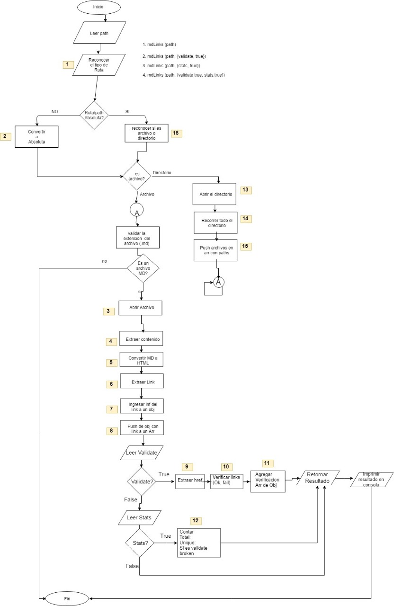

# Markdown Links

## Diagrama de flujo




## Pseudocodigo

| Función    | Ingresa     |Proceso     |Salida     |
| ------------- | ------------- | ------------- | ------------- |
| 1. evaluatePath | Ruta (string) | Utilizar método path.isAbsolute para reconocer si la ruta es absoluta| true/false (booleano) |
| 2. transformToAbsPath | Ruta (string) | Utilizar método path.resolve para convertir ruta relativa a absoluta| Ruta absoluta (string)) |
| 16. recognizeIfIsFile | Ruta absoluta (string) | Utilizar método fs.lstat.isFile para reconocer si es archivo| true/false (booleano) |
| 13. getFiles | Ruta absoluta (string) | Obtener todos los archivos| Array con las rutas de todos los archivos(array) |
| 3. getMDContent | Ruta absoluta MD (string) | Obtener contenido del archivo markdown utilizando la libreria fs.readFile (con UTF)| Contenido(string)|
| 5. convertMDToHtml | Contenido (string) | Usar librería Marked para convertir contenido a HTML| Contenido HTML(string)|
| 7. extractATagAttr | HTML (string) | Utilizar librería JSDOM para obtener href y contenido de los link.| Informacion de los link(objeto)|
| 8. createArrLinkObj | Informacion de los link(objeto) | Crear array, meter objeto a array.| Array con informacion de links dentro de objeto(array)|
| 9. extractHref | Array con objetos(array) | Extraer href de cada objeto y guardarlo en un nuevo array| Array con href de cada link(array)|
| 10. validateLink | Array con href de cada link(array) | Utilizar node-fetch para evaluar href | Array con status de cada link(array)|
| 12. calculateStats | Array con links o Array con links validados (array) | Calcular total de links, unicos, y rotos.| total, unique y broken (objeto)|

## Product Backlog


## Documentación técnica

El propósito de esta librería es que el usuario pueda obtener los links que se encuentran dentro de archivos markdown, ya sea ingresando la ruta de un archivo markdown o de carpetas que contengan archivos markdown, también brinda la opcion para verificar el status de cada link y obtener estadisticas como el total de links, cuantos son únicos o no se repiten y cuantos estan rotos.

## Instalación

Para instalar esta librería tienes que ejecutar el siguiente comando:

`npm i mahalirobles-mdlinks`

## Uso en línea de comandos

Hay cuatro opciones:

1. Para obtener los links, ingresar md-links y la ruta del archivo o directorio.

```sh
$ md-links ./some/example.md
./some/example.md http://algo.com/2/3/ Link a algo
./some/example.md https://otra-cosa.net/algun-doc.html algún doc
./some/example.md http://google.com/ Google
```

2. Para obtener los links y saber su status (si esta bien o roto), ingresar md-links, ruta del archivo o directorio y la opcion --validate.

```sh
$ md-links ./some/example.md --validate
./some/example.md http://algo.com/2/3/ ok 200 Link a algo
./some/example.md https://otra-cosa.net/algun-doc.html fail 404 algún doc
./some/example.md http://google.com/ ok 301 Google
```

3. Para obtener el total de links y cuantos no se repiten, ingresar md-links, ruta del archivo o directorio y la opcion --stats.

```sh
$ md-links ./some/example.md --stats
Total: 3
Unique: 3
```

4. Para obtener el total de links, cuantos no se repiten y cuantos estan rotos, ingresar md-links, ruta del archivo o directorio y las opciones --validate --stats.

```sh
$ md-links ./some/example.md --validate --stats
Total: 3
Unique: 3
Broken: 1
```

## Uso como API

`let mdLinks = require('mahalirobles-mdlinks')`

Hay cuatro opciones:

1. Para obtener un array con los links, ingresar mdLinks y la ruta del archivo o directorio.

```sh
mdLinks(./some/example.md)
.then(links => {
  // => [{ href, text, file }]
  })
.catch(console.error);
```

2. Para obtener un array con los links indicando su status (si esta bien o roto), ingresar md-links, ruta del archivo o directorio y la opcion {validate:true, stats:false}

```sh
mdLinks(./some/example.md, {validate:true})
.then(links => {
    // => [{ href, text, file, status, ok }]
  })
.catch(console.error);
```

3. Para obtener un objeto con la informacion de total de links y cuantos no se repiten, ingresar md-links, ruta del archivo o directorio y la opcion {validate:false, stats:true}

```sh
mdLinks(./some/example.md, {stats:true})
.then(links => {
    // => { total:3 , unique:3 }
  })
.catch(console.error);
```

3. Para obtener un objeto con la informacion de total de links, cuantos no se repiten y cuantos estan rotos, ingresar md-links, ruta del archivo o directorio y la opcion {validate:true, stats:true}

```sh
mdLinks(./some/example.md, {validate:true, stats:true})
.then(links => {
    // => { total:3 , unique:3, broken:1 }
  })
.catch(console.error);
```


